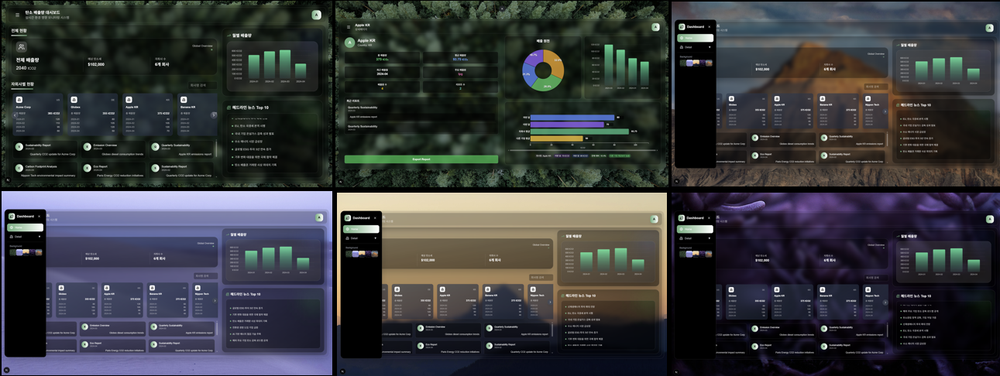

## 👋 소개

이 프로젝트는 **웹 기반 탄소 배출 대시보드**입니다.  
관리자가 있는 가정 하에, 사용자는 **자사 및 자회사의 월별 탄소 배출 현황**을 확인하고 비교할 수 있습니다.

- 특정 회사의 자회사별 배출량 확인 (가솔린, 디젤, LPG 등)
- 포스트 데이터를 통한 기록 확인 및 다운로드
- 선택한 자회사의 상세 정보 조회

</br>

## 🛠 기술 스택

- **Next.js 14**
- **Tailwind CSS 4**
- **D3.js 7.9.0**
- **TypeScript**

</br>

## ⏱ 설치 및 실행 방법

```
npm install
npm run dev
```

</br>

## ⏱ UI


